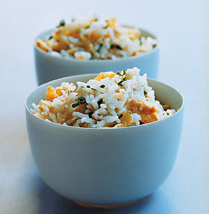

# Fried rice

*In China, fried rice is eaten as a 'filler' at the end of a dinner party. It is not eaten with other dishes in place of steamed rice. Although fried rice is common in Chinese restaurants, it is frequently incorrectly cooked.*

- *The cooked rice should be thoroughly cool before frying, preferably cold. Once cooled, much of the moisture in the rice evaporates, allowing the oil to coat the dry grains and keep them from sticking.*
- *Never cook the egg before adding to the rice, this will make it tough and dry.*
- *Always make sure the oil is hot enough before adding the rice, or it will saturate the rice making it greasy and heavy.**

**Serves:** 4

## Ingredients
- 400 ml steamed rice (cold)
### For the fried rice
- 50 grams Parma ham
- 2 tablespoons groundnut oil
- 2 eggs (beaten)
- 110 grams fresh bean sprouts
- 2 tablespoons light soy sauce
- 1 tablespoon sesame oil
- ground white pepper
### Garnish
- 2 tablespoons spring onions (finely chopped)

## Method
1. Cut the Parma ham into fine dice.
1. Heat a wok or large frying pan until it is hot.
1. Add the oil and wait until it is almost smoking.
1. Add the cooked rice and stir-fry for 1 minute.
1. Add the Parma ham and the salt.
1. Continue to stir-fry for 5 minutes over a high heat.
1. Add the beaten egg and the bean sprouts and continue to stir-fry for 2 minutes or until the egg has set.
1. Mix in the soy sauce, sesame oil and white pepper.
1. Turn the mixture onto a plate and garnish it with the spring onions.
