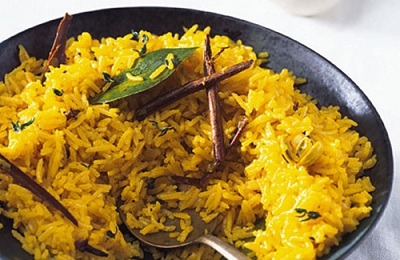

# Pilau rice

**Prep Time:** 
**Cooking Time:** 
**Serves:** 

## Ingredients
- 450 grams basmati rice
- 1 onion (finely chopped)
- large knob butter (plus extra to serve)
- 4 cardamom pods
- 8 cloves
- 1 cinnamon stick
- pinch saffron threads
- 2 bay leaves
- 600 ml hot chicken stock
- salt

## Method
1. Wash the rice in a sieve until the water runs clear, then tip the rice into a bowl, covered with water and leave to soak for about 30 minutes in fresh cold water.
In a large heavy-based pan, add the butter and heat until it starts to bubble, and then add the onions.
Cook for around 5 minutes, until softened.
Add the cardamom pods, cloves, cinnamon, saffron and bay leaves.
Cook for 2 minutes on a low heat.
Add the rice and stir until the grains are coated in the butter before stirring in the stock and salt.
Bring to the boil and then cover with a tight-fitting lid.
If the lid isn't very tight, cover the pan with aluminium foil before putting the lid on.
Turn the heat down low and leave to cook for 10 minutes before turning off the heat.
Don't remove the lid; just leave the rice to continue cooking in the pan for about 5 minutes until you're ready to serve.
The rice should have absorbed all the water and will just need fluffing up with a fork.
Add a knob of butter before serving.
