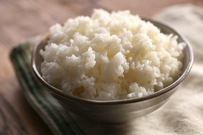

# Steamed rice

*Steaming rice the Chinese way is quite easy. Long-grain rice is preferred which is drier and fluffier when cooked.*

*The secret to preparing rice without it being sticky is to cook it first at a high heat until most of the water has evaporated. Then the heat should be turned very low, the pot covered and the rice cooked slowly in the remaining steam. Make sure you do not lift the top of the pot whilst the rice is steaming as this will ruin the rice, and is considered bad luck in China.*

*A good tip is to make sure that the rice is covered by 1 inch of water, so that it will always cook properly without sticking.*

**Prep Time:** 
**Cooking Time:** 
**Serves:** 

## Ingredients
- 400 ml long grain rice
- 900 ml water

## Method
1. Put the rice in a large bowl and wash it in several changes of water until the water becomes clear.
1. Drain the rice and put it in a heavy pot with the water and bring to the boil.
1. Continue boiling until most of the surface liquid has evaporated (This should take about 15 - 20 minutes)
1. The surface of the rice should have small indentations like a pitted crater.
1. At this point, cover the pot with a very tight fitting lid, turn the heat as low as possible and let the rice cook undisturbed for 15 - 20 minutes.