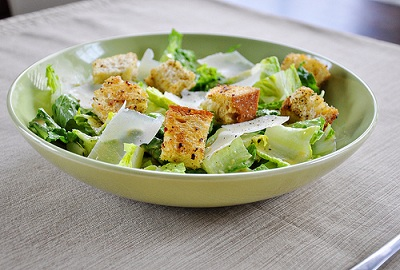

# Caesar salad

*This salad, created by Caesar Cardini, from Caesar's Palace in Los Angeles is an absolute classic that is wonderful either as a starter or a main meal.*

**Serves:** 4

## Ingredients
### For the salad
- 2 cos lettuces
- 2 medium chicken fillets (sliced)
- 300 grams pancetta
- 4 thick slices of wholemeal bread
- olive oil
- 25 grams Parmesan (grated)
- 50 grams Parmesan (flakes)
- olive oil (for frying)

### For the dressing
- 15 grams anchovy fillets (drained and chopped)
- 2 teaspoons capers
- 2 teaspoons Worcestershire sauce
- half teaspoon Dijon mustard
- a dash of Tabasco sauce
- juice of half a lemon
- half garlic clove (crushed)
- 2 tablespoons Parmesan (finely grated)
- 1 egg (boiled for 90 seconds only, and shelled)
- 150 - 300 ml extra virgin olive oil
- Freshly ground black pepper

## Method
1. Preheat the oven to 200°C
1. Fry the chicken breasts in 2 tablespoons of the olive oil until golden, and set aside.
1. Add a tablespoon of olive oil to the pan, and fry the pancetta until crispy, set aside.
1. Break down the lettuces into separate leaves.
1. Remove the crusts from the bread and cut into 1 cm cubes.
1. Place the bread in a roasting tin, and sprinkle over olive oil, and a little pepper.
1. Bake the bread in the oven, tuning them every minute until they are golden and crispy, toss in the grated Parmesan and set aside to cool.
1. Place the dressing ingredients in a blender, using 150 ml of the oil and purée until thick and creamy.
1. If necessary, add more oil, a little at a time and purée until the sauce is thick and emulsified. It should be able to coat the back of a spoon.

### To make the salad
1. Toss the lettuce leaves in the dressing, making sure they are all coated.
1. Add the chicken, pancetta, croûtons and half of the Parmesan flakes and dived between the salad bowls.
1. Sprinkle with the remaining Parmesan and serve.