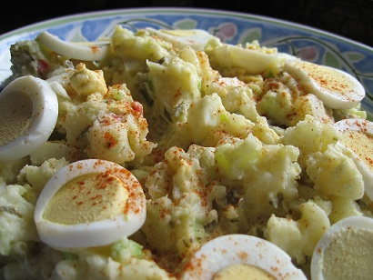

# Hot cajun potato salad

*In Cajun country, where Tabasco originates, hot means really hot, and this potato salad is no exception.*

**Prep Time:** 
**Cooking Time:** 
**Serves:** 

## Ingredients
- 8 waxy potatoes
- 1 green chilli (de-seeded and diced)
- 4 spring onions (shredded)
- 3 eggs (hard boiled, shelled and chopped)
- 250 ml mayonnaise
- 1 tablespoon Dijon mustard
- Tabasco sauce (to taste)
- ¼ teaspoon garam masala
- ¼ teaspoon ground cumin
- ¼ teaspoon dried coriander
- ¼ teaspoon cayenne pepper
- 2 teaspoons thyme (chopped)
- salt and ground black pepper
- salad leaves (to serve)

## Method
1. Put the unpeeled potatoes in a pan of cold salted water, bring to the boil and cook for 20 - 30 minutes, until tender.
1. Drain the potatoes, and set aside to cool enough to handle.
1. Peel the potatoes, and cut into large chunks.
1. Place the potatoes in a large bowl and add the chopped chilli, spring onions and eggs. Mix gently.
1. In a separate bowl, mix the mayonnaise with the mustard and season with salt and black pepper. Add Tabasco sauce to taste.
1. Mix in the cumin, coriander and thyme.
1. Add the dressing to the potato mixture, toss gently to coat then sprinkle over the cayenne and garam masala.