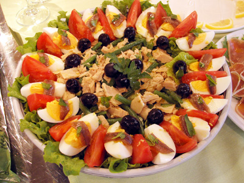

# Niçoise salad

**Serves:** 4

## Ingredients
- 12 very thin slices of French bread
- 4 tablespoons olive oil
- 1 head of soft lettuce
- 8 black olives (stoned and quartered)
- 2 tomatoes (seeded and cut into wedges)
- 1 teaspoon capers
- 100 grams fine beans
- 1 tablespoon butter
- 1 teaspoon sesame seeds
- 1 garlic clove (finely chopped)
- 4 anchovy fillets (drained)
- 8 new potatoes (cooked and sliced)
- 400 grams tuna fillet steaks

### For the dressing
- 8 tablespoons olive oil
- 2 tablespoons tarragon vinegar
- half teaspoon Dijon mustard
- Salt and freshly ground black pepper
- half garlic clove (finely chopped)
- half teaspoon fresh chives (finely chopped)
- half teaspoon tarragon (freshly chopped)
- 2 hard boiled eggs (roughly chopped)

## Method
1. Place the beans in a pan of salted boiling water for 2 minutes, plunge into a bowl of ice cold water and drain.
1. Heat the butter and garlic in a frying pan, and as soon as the butter begins to form a froth, fry the beans for 2 minutes. Once cooked, remove from the pan, shake the sesame seeds over and allow to cool.
1. Mix all the dressing ingredients together, except the herbs and eggs in a bottle.
1. Brush the bread with olive oil and toast until crisp and golden on both sides.
1. Separate the salad leaves, and add the olives, tomatoes, capers, fine beans and anchovy fillets.
1. Add the potato slices and season with salt and pepper.
1. Season the tuna with salt and pepper and grill or shallow fry for about 1 - 1 ½ minutes on each side, keeping the tuna medium to medium - rare.
1. While the tuna is cooking, mix the salad dressing with the chopped herbs and hard boiled egg.
1. Pour some over the salad and toss together with the toasts.
1. Divide between the plate and sit the tuna on top.