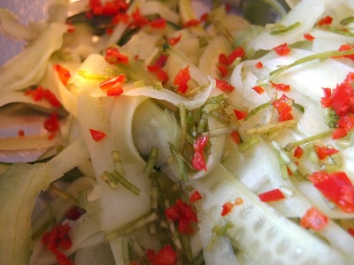

# Thai cucumber salad

*A piquant and sour salad that compliments a Thai red or green curry wonderfully.*

**Serves:** 4

## Ingredients
- 2 cm piece of fresh ginger
- 1 tablespoon soy sauce
- 1 teaspoon sesame oil
- 1 lime
- 1 cucumber
- 1 small handful of fresh coriander
- half a fresh red chilli
- sesame seeds (to garnish)

## Method
1. Peel and grate the ginger on to a serving platter and add the soy sauce, extra virgin olive oil and sesame oil.
1. Squeeze in the juice of the lime, then check the seasoning.
1. Use a speed-peeler to peel the cucumber in long ribbons over the platter.
1. Discard the watery core.
1. Take a small handful of coriander and finely chop the stalks, putting the leaves aside.
1. Sprinkle the stalks over the cucumber.
1. Finely chop the chilli and sprinkle over.
1. Take to the table but don’t toss and dress until you're ready to eat.
1. Sprinkle Sesame seeds over the salad
