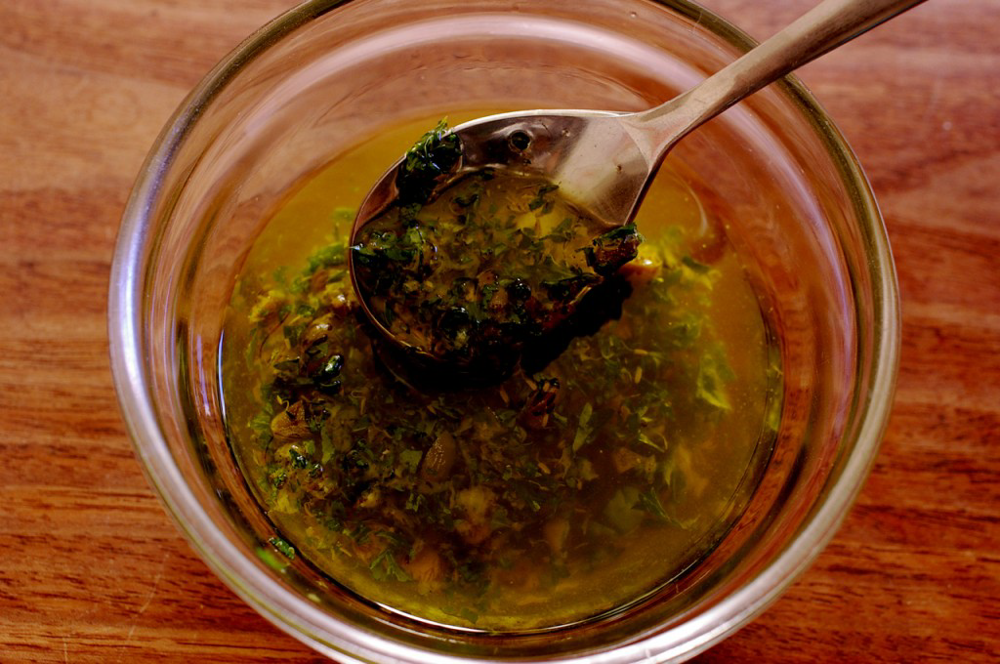

# Herb Salsa

*This salsa goes particularly well with pasta, especially tortellini or cappelletti.*

**Servings:** 6

## Ingredients
- 60 grams potato
- 60 grams Fines herbes
- 40 ml sherry vinegar
- 120 ml olive oil
- juice of 1 lemon
- 30 grams spring onions (finely chopped)
- 1 tablespoon coarse grain Meaux mustard
- salt and pepper

## Method
1. Boil the potato in its skin, then peel and press through a potato ricer into a bowl. 
1. Add all the other ingredients and stir to combine, seasoning with salt and pepper to taste.