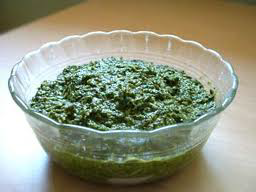

# Pesto

*A perfect pesto, works especially well when adding to Béchamel for Lasagne*

## Ingredients
- 40 grams fresh basil leaves
- 1 clove garlic (peeled)
- 30 grams pine nuts
- 120 ml extra virgin olive oil
- 20 grams Parmesan cheese (grated)
- 1 pinch salt

## Method
1. Place the basil, garlic and pine nuts in a food processor, and add the olive oil. 
1. Purée for about 10 seconds until the mixture is smooth.
1. Transfer to a bowl and fold in the cheese. 
1. Season with salt and set aside.