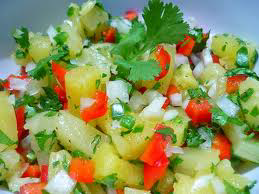

# Pineapple Salsa with Coriander

*A delicious salsa to go with barbequed dishes, such as pork spareribs or sausages, duck breast or swordfish. It is best served warm, so should ideally be prepared at least an hour in advance.*

**Servings:** 4

## Ingredients
- 1 tablespoon soft brown sugar
- 300 grams pineapple (1 cm cubes)
- half a red chilli (finely diced)
- 1 tablespoon sambal oelek
- 1 teaspoon lime juice
- 2 tablespoons coriander leaves (chopped)
- 1 pinch salt

## Method
1. Place a non-stick frying pan over a medium heat and sprinkle in the sugar. 
1. As soon as the sugar has melted and nearly caramelized, add the diced pineapple. 
1. Cook the pineapple, stirring every minute or so with a wooden spatula, until lightly caramelized, about 4 - 5 minutes.
1. Tip the pineapple into a large bowl and add the chilli, sambal oelek, lime juice and coriander. 
1. Mix well with a spoon. adding a touch of salt to taste.
1. Cover with cling film and set aside until ready to serve.