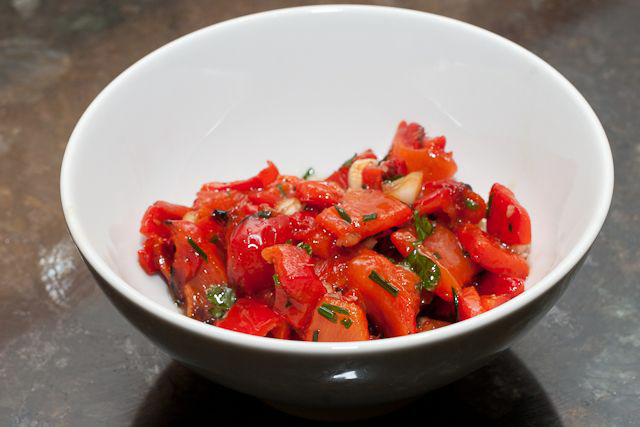

# Red pepper salsa

*This salsa works well with pasta or in bouchée as a canapé*

**Servings:** 8

## Ingredients
- 4 red peppers
- 2 shallots (finely chopped)
- 2 sprigs thyme (leaves only, chopped)
- 12 basil leaves (snipped)
- 125 ml olive oil
- 2 lemons (juice only)
- salt and pepper (to taste)

## Method
1. Lightly oil the peppers, and either grill or roast in the oven them until the skin is blackened. 
1. Place in a plastic food bag, and leave to sweat. 
1. Once cooled, peel off the skin, and remove the core, seeds and white membrane.
1. Dice the peppers as finely as possible and place in a bowl. 
1. The texture should be between tiny dice and a coulis.
1. Add the shallots, thyme and basil to the peppers and season with salt and pepper, stir in the olive oil and lemon juice.
1. Taste and add seasoning if necessary.