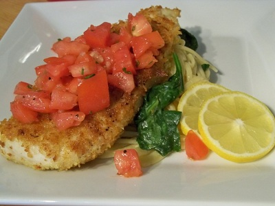

# Tomato and Basil Salsa

*A delicate salsa which goes beautifully with seafood, lightly cooked on the barbeque, and with fish. It also works well with cold chicken or veal.*

**Servings:** 6

## Ingredients
- 200 grams tomatoes (very ripe)
- 3 tablespoons capers (well drained)
- 50 grams black olives (pitted and finely diced)
- 150 ml  olive oil
- juice of 1 lemon
- 20 grams basil leaves (snipped)
- salt and coarsely ground white pepper

## Method
1. Peel, de-seed and dice the tomatoes and place in a large bowl. 
1. Add all the other ingredients, except the basil, seasoning with salt and pepper to taste. 
1. Mix together with a spoon.
1. Cover with cling film and leave to stand for up to an hour to let the flavours combine. 
1. About 30 minutes before serving, add the basil and stir to combine. 
1. Serve the salsa at room temperature.