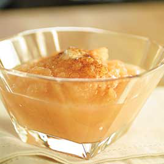

# Apple sauce

**Servings:** 6

## Ingredients
- 500 grams dessert apples (preferably Cox's)
- 20 grams caster sugar
- juice of half a lemon
- half a stick cinnamon
- 30 grams butter
- pinch of salt

## Method
1. Peel, core and finely dice the apples. 
1. Place them in a heavy-based saucepan with 150 ml water, along with the sugar, lemon juice and cinnamon.
1. Bring to a simmer over a medium heat, then cover and cook for about 15 minutes until the apples are tender but not dried out. 
1. Discard the cinnamon stick.
1. Take the pan off the heat and, using a small whisk, incorporate the butter and a pinch of salt to make a smooth compote. 
1. The consistency will vary according to how ripe or green the apples are. 
1. If the sauce seems too thick, add a couple of tablespoons of water to thin it slightly. 
Serve warm.