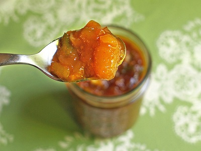

# Mango chutney

*This lightly spiced, sweet chutney provides a lovely contrast to a spicy meal and is perhaps one of the best known and loved Indian chutneys.*

**Yield:** 500ml

## Ingredients
- 1 tablespoon sunflower oil
- 1 teaspoon ginger (finely grated)
- 1 garlic cloves (crushed)
- 5 cloves
- 1 star anise
- 2 cinnamon sticks
- 5 black peppercorns
- 2 tablespoons nigella seeds
- ½ teaspoon mild chilli powder
- 800 grams ripe but firm mango flesh (chopped)
- 400 ml white wine vinegar
- 270 grams caster sugar
- sea salt

## Method
1. Heat the sunflower oil in a saucepan over a medium heat.
1. Add the ginger, garlic, cloves, star anise, cinnamon , peppercorns, nigella seeds and chilli powder and stir-fry for 1 - 2 minutes.
1. Add the mango, vinegar and sugar and bring to the boil.
1. Reduce the heat to low and cook for 45 minutes, or until the mixture is jam-like.
1. Season with sea salt to taste and pour into hot sterilized jam jars.
1. Seal and leave to cool before storing in the refrigerator for up to 2 months.