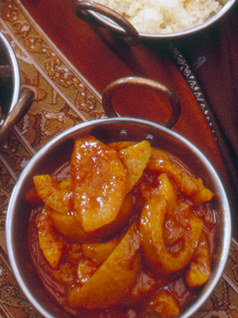

# Peach chutney

*Make this chutney during the summer, when peaches are at their best. Serve it with terrines, pâté and cold meats, especially cold roast chicken.*

**Yield:** 700 grams

## Ingredients
- 60 grams cooking apples (cored, peeled and grated)
- half a teaspoon salt
- 125 grams very ripe tomatoes (peeled, de-seeded and chopped)
- 60 grams onion (finely chopped)
- zest of 1 lime (finely pared and chopped)
- juice of 1 lime
- 150 grams caster sugar
- half a teaspoon ground cinnamon
- half a teaspoon ground nutmeg
- half a teaspoon white pepper
- 1 clove garlic (crushed)
- 10 grams ginger (finely chopped)
- 150 ml white wine vinegar
- 70 grams flaked almonds
- 500 grams ripe, but firm peaches

## Method
1. Combine all the ingredients except the peaches in a heavy-based saucepan and bring to the boil over a very low heat, stirring from time to time with a wooden spoon. 
1. Continue to cook for about 30 minutes, giving a stir every 10 minutes, until the mixture is jam-like and syrupy. 
1. Test by running your finger down the back of the spoon; it should leave a clear trace.
1. In the meantime, peel the peaches: run the tip of a knife around the circumference, then immerse in a pan of boiling water.
1. As soon as the skin starts to lift along the incision, take the peaches out and refresh in iced water.
1. Lift out and pull off the skin. Halve and stone the peaches, then either cut the flesh into cubes or strips.
1. Add the peaches to the chutney mixture and cook very gently for another 40 minutes, stirring very gently every 10 minutes.
1. Transfer to a warm, sterilised preserving jar, leave to cool, then seal the jar. 
1. This will keep in the fridge for up to several weeks.