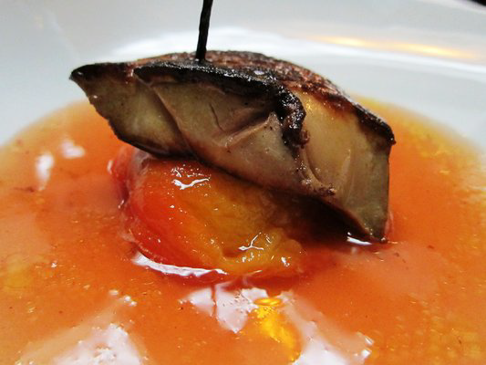

# Peach sauce

*This sauce goes particularly well with roasted pigeon or young duckling.*

**Servings:** 4

## Ingredients
- 2 very ripe peaches
- 30 grams butter
- 30 grams caster sugar
- 20 ml cognac
- 3 tablespoons red wine vinegar
- 100 ml red wine (preferably Burgundy)
- 1 clove
- 2 teaspoons fennel seeds
- 300 ml veal stock
- 40 grams butter (chilled and diced)
- salt and pepper

## Method
1. To peel the peaches, lightly score around the middle, then immerse in boiling water until the skin starts to lift. 
1. Refresh in iced water, then peel, stone and cut into cubes.
1. Melt the butter in a frying pan, add the sugar and stir until lightly caramelised. 
1. Add the peaches, increase the heat and cook, stirring continuously, until almost collapsed into a purée. 
1. Add the Cognac, bubble briefly, then add the wine vinegar and bubble for 1 minute. 
1. Add the red wine and spices and cook gently for 10 minutes, skimming as necessary.
1. Pour in the veal stock and simmer for 30 minutes, or until reduced and thickened. 
1. Strain into a clean pan and whisk in the butter, a little at a time. 
1. Season and serve.
