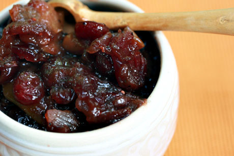

# Pear chutney

*After making, this chutney is best left for a few days before eating, to allow the flavours to develop. Serve it with cold meats, terrines, pâté and game, or spread on bread.*

**Yield:** 600 grams

## Ingredients
- 60 grams cooking apples (cored, peeled and chopped)
- half a teaspoon salt
- 125 grams very ripe tomatoes (peeled, de-seeded and chopped)
- 60 grams onion (finely chopped)
- 60 grams sultanas
- 1 tablespoon orange zest (coarsely chopped)
- juice of 1 orange
- 150 grams caster sugar
- 1/4 teaspoon ground cinnamon
- 1/4 teaspoon ground nutmeg
- 1/4 teaspoon cayenne pepper
- 15 grams ginger (finely chopped)
- 150 ml white wine vinegar
- 375 grams ripe, but firm pears
- pinch saffron threads

## Method
1. Combine all the ingredients, except the pears in a heavy-based saucepan. 
1. Stir and bring to the boil over a very low heat, stirring from time to time with a wooden spoon.
1. Continue to cook for about 1 hour, giving the mixture a stir every 10 minutes, until it is jam like and syrupy. 
1. Test by running your finger down the back of the spoon; it should leave a clear trace.
1. In the meantime, peel and core the pears, then cut into small even-sized pieces. 
1. Add to the chutney mixture and cook very gently for another 40 minutes, stirring every 10 minutes.
1. Transfer the chutney to a warm, sterilised preserving jar and leave to cool, then seal the jar. 
1. This will keep in the fridge for up to several weeks.