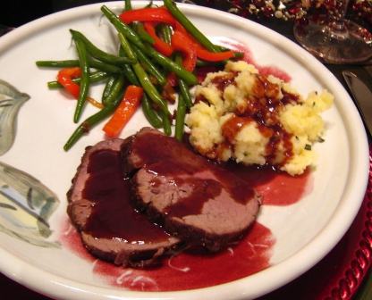

# Port sauce

*This light sauce is excellent with pan-fried pheasant breasts and venison cutlets.*

**Servings:** 4

## Ingredients
- 60 grams butter
- 60 grams shallots (very finely sliced)
- 100 grams button mushrooms (finely sliced)
- 50 grams blackcurrants (or cranberries)
- 250 ml ruby port
- dried zest of 1/4 of an orange (see notes)
- 300 ml Veal stock
- salt and pepper

## Method
1. Melt half the butter in a small saucepan. 
1. Add the shallots and sweat until soft, then add the mushrooms and fruit and cook gently for 3 - 4 minutes.
1. Pour in the port, add the orange zest and reduce by one-third. 
1. Add the stock and simmer for 25 minutes, skimming the surface whenever necessary.
1. Pass the sauce through a fine-meshed conical sieve into a clean pan. 
1. Swirl in the rest of the butter, shaking and rotating the pan, then season to taste with salt and pepper.
1. The sauce is now ready to serve.

**Note**: To dry the orange zest , lay strips on a baking sheet and dry in the oven on its lowest setting for about 2 hours. Leave to cool.