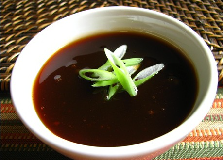

# Sweet and sour sauce

*This perfect dipping sauce for scampi and squid tempura, this sauce is also very good with sashimi, ham and other cold meat dishes.*

**Servings:** 6

## Ingredients
- 200 grams green peppers
- 200 grams red peppers
- 2 tablespoons groundnut oil
- 200 grams onions (finely chopped)
- 100 grams demerara sugar
- 100 ml red wine vinegar
- 100 ml stock (veal, chicken or vegetable)

## Method
1. Oil the peppers very lightly and grill them (either under a hot grill or in the oven) until their skins are blistered and blackened. 
1. Plunge the peppers into a bowl of iced water to cool them quickly, then remove and peel off the skins. 
1. Halve the peppers, remove the core, pith and the seeds, then dice the flesh.
1. Gently heat the groundnut oil in a heavy-based saucepan. 
1. Add the onions and sweat gently for 5 minutes, stirring with a wooden spoon. 
1. Add the peppers and sweat, stirring for another 5 minutes. 
1. Add the sugar and cook until the vegetables are lightly caramelised, stirring all the time.
1. Pour in the wine vinegar, stirring to deglaze the pan, and let bubble over a medium heat until the liquid has been reduced by two-thirds. 
1. Add the stock and cook until the sauce is reduced and lightly coats the back of a spoon. 
1. Season with salt and pepper to taste.
1. Serve this sauce tepid or cold.