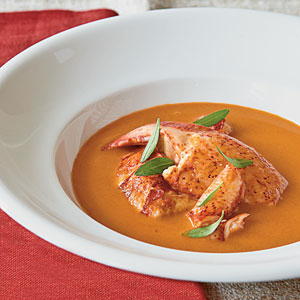

# Américaine sauce

*This classic supreme sauce takes time to prepare, but is well worth the effort. Serve it with firm-fleshed fish, such as poached turbot, or a fish soufflé.*

**Servings:** 6

## Ingredients
- 1 live lobster (about 800g, rinsed)
- 100 ml groundnut oil
- 4 tablespoons carrots (very finely diced)
- 2 tablespoons shallots (very finely diced)
- 2 cloves garlic (unpeeled, smashed)
- 50 ml Cognac
- 300 ml dry white wine
- 300 ml Fish stock
- 200 grams tomatoes (very ripe, peeled, de-seeded and chopped)
- 1 Bouquet garni (with extra tarragon sprig)
- 60 grams butter
- 10 grams plain flour
- 75 ml double cream (optional)
- 1 pinch cayenne pepper
- salt and pepper

## Method
1. Plunge the lobster into a large pan of boiling water for 45 seconds. Lift out and place on a board. Separate the head and body and cut the claw joints and tail into rings across the articulations. Split the head length-ways and remove the gritty sac close to the feelers, and the greyish membranes. Scrape out the greenish coral from the head and reserve in a bowl. Season the lobster with cayenne, salt and pepper.
1. Heat the groundnut oil in a deep sauté pan over a high heat. When it is sizzling, add the lobster pieces and sauté until the shell turns bright red and the flesh is lightly coloured. Remove with a slotted spoon on to a plate. Discard most of the oil in the pan.
1. Sweat the carrots and shallots in a pan until soft but not coloured. Add the garlic and return the lobster to the pan. Pour in the Cognac and ignite. Once the flames have died down, pour in the wine and stock. Add the tomatoes, bouquet garni and a little salt. As it comes to the boil, lower the heat and cook gently for 15 minutes.
1. Remove and reserve the claws and rings of lobster tail containing the meat. Cook the sauce at a gentle bubble for a further 30 minutes, skimming it once or twice.
1. With a fork, mash the lobster coral with the butter and flour, then add to the sauce, a little at a time. Cook for 5 minutes, then add the cream, if using and pass through a fine-meshed conical strainer, pressing with the back of a ladle. Season to taste.

**Note**: For a lighter texture, purée the sauce in a blender for 1 minute. Remove the reserved lobster meat from the shell, dice it and add to the sauce just before serving.