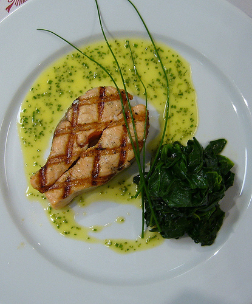

# Bercy sauce

*This simple, classic sauce goes well with and red or white fleshed fish, like skate or dogfish.*

**Servings:** 6

## Ingredients
- 60 grams butter (chilled and cut into cubes)
- 60 grams shallots (finely chopped)
- 200 ml dry white wine
- 150 ml Fish stock
- 400 ml [Velouté sauce](./veloute-sauce.md)
- juice of half a lemon
- 2 tablespoons parsley (chopped)
- salt and pepper

## Method
1. Melt 20 grams of butter in a saucepan, add the chopped shallots and sweat them gently for 1 minute, without colouring.
1. Pour in the white wine and fish stock and cook over a medium heat until the liquid has reduced by half.
1. Add the fish velouté and simmer gently for 20 minutes.
1. The sauce should be thick enough to coat the back of a spoon lightly. If it is not, cook it for a further 5-10 minutes.
1. Turn off the heat and whisk in the remaining butter, a small piece at a time, followed by the lemon juice. 
1. Season the sauce with salt and pepper to taste, stir in the chopped parsley and serve immediately.