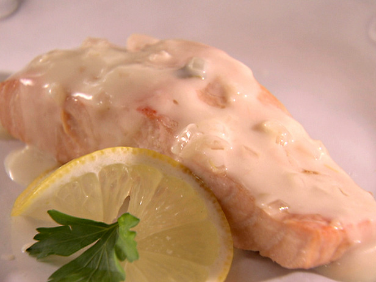

# Champagne sauce

*This sauce is perfect for poached fish, such as John Dory, turbot or sole. You can substitute sparkling white wine for the Champagne, but the sauce will not taste quite as good.*

**Servings:** 6

## Ingredients
- 50 grams butter
- 60 grams shallots (very finely sliced)
- 60 grams button mushroom (finely sliced)
- 400 ml champagne
- 300 ml Fish stock
- 350 ml double cream
- salt and pepper

## Method
1. Melt 20 grams of butter in a saucepan. Add the sliced shallots and sweat them for 1 minute, without colouring. 
1. Add the mushrooms and cook for a further 2 minutes, stirring continuously with a wooden spatula.
1. Pour in the Champagne and reduce by one-third over a medium heat. 
1. Add the fish stock and reduce the sauce by half.
1. Pour in the cream and let the sauce bubble to reduce until it lightly coats the back of a spoon. 
1. Pass it through a fine-meshed conical sieve into a clean pan.
1. Whisk in the remaining butter, a piece at a time, then season the sauce to taste with salt and pepper.

**Note**: For a lighter texture, purée the sauce in a blender for 1 minute before serving.