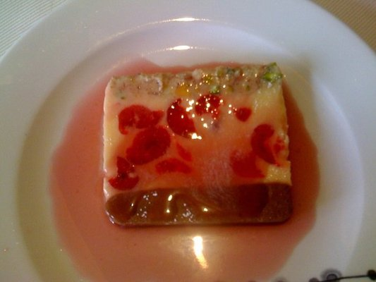

# Claret sauce

*This characterful sauce makes a wonderful base for pink-fleshed fish, such as salmon, red mullet or tuna escalope. Pan-fry the fish at the last moment, pour the sauce on to the plate and place the fish on top.*

**Servings:** 8

## Ingredients
- 300 ml full bodied red wine
- 200 ml Veal stock
- 300 ml Fish stock
- 50 grams shallots (finely sliced)
- 60 grams button mushrooms (finely sliced)
- 1 Bouquet garni
- 50 ml double cream
- 200 grams butter
- salt and pepper

## Method
1. Pour the red wine and both stocks into a saucepan and add the sliced shallots, mushrooms and bouquet garni.
1. Bring to the boil over a medium heat and let bubble to reduce until slightly syrupy.
1. Remove the bouquet garni, add the cream and let the sauce bubble for a minute or so, then strain it through a fine-meshed conical sieve into a clean saucepan.
1. Whisk in the butter, a piece at a time, until the sauce is rich and glossy. 
Season to taste and serve hot.