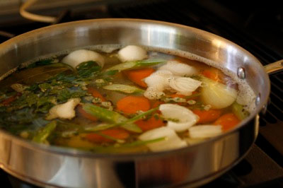

# Court bouillon

*Traditionally, the poaching liquid for fish consists of water and white wine plus flavourings, known as a court-bouillon. Poaching a fish such as salmon helps maintain its natural colour and helps keep the flavours locked in, and the flesh moist.*

## Ingredients
- 2 leeks (white part only, chopped into large rounds)
- 2 carrots (peeled and sliced into large rounds)
- 2 onions (roughly chopped)
- 1 bouquet garni
- 10 black peppercorns
- 400 ml dry white wine
- 100 ml white wine vinegar
- 2 lemons (halved)
- 1 litre water

## Method
1. Place the vegetables, bouquet garni and peppercorns in a large saucepan and cover with the water.
1. Place the pan over a medium heat and bring to the boil.
1. Reduce to a simmer and add the white wine and vinegar.
1. Squeeze in the juice from the lemons and add the halves.
1. Remove from the heat and allow to sit for 10 minutes.
1. Strain and reserve for poaching the fish.
1. Warm the court-bouillon in a wide-bottomed saucepan over a medium-low heat until the temperature f the liquid reaches 50°C.
1. Place the fish in the liquid and bring the liquid back to 50°C. Maintain this temperature for 10 minutes or until the internal temperature of the fattest part of the fish reaches 45°C.
1. Carefully remove the fish with a spatula and rain well.