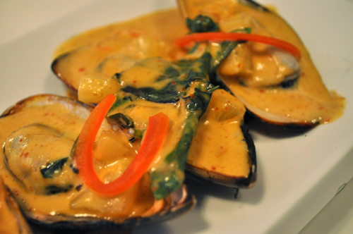

# Curried mussel sauce

*Perfect with shelled mussels cooked à la marinière, this is also very good with poached cod or halibut, nice pilaf and pasta.*

**Servings:** 6

## Ingredients
- 50 grams butter
- 60 grams onions, finely chopped
- 2 teaspoons curry powder
- 15 grams plain flour
- 500 ml cooking liquor from mussels and other shellfish (cooled)
- 1 Bouquet garni
- 150 ml double cream
- salt and pepper

## Method
1. Melt the butter in a saucepan, add the onions and sweat over a low heat for 3 minutes. 
1. Add the curry powder, then the flour, stir with a wooden spoon and cook for another 3 minutes.
1. Pour in the cold shellfish juices, add the bouquet garni and bring to the boil.
1. Let the sauce bubble very gently for 20 minutes, stirring every 5 minutes.
1. Add the cream, let bubble for another minute or so, then discard the bouquet garni.
1. Season the sauce to taste with salt and pepper. Serve immediately.