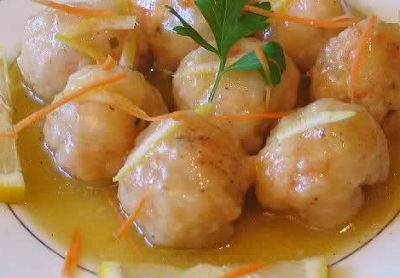

# Lemon sauce

*This wonderfully fragrant lemon sauce is perfect for white firm-fleshed steamed fish, it is also suited to stir-fried chicken.*

**Servings:** 4

## Ingredients
-   70 ml [Chinese chicken stock](../../stocks/chinese-chicken-stock.md)
- 1½ tablespoons lemon juice(freshly squeezed)
- 2 teaspoons sugar
- 2 teaspoons light soy sauce
- 2 teaspoons dry sherry or rice wine
- ½ teaspoon garlic (finely chopped)
- 1 dried red chilli
- 1 teaspoon cornflour (blended with 1 teaspoon water)

## Method
1. Add all the sauce ingredients except for the cornflour mixture.
1. Bring it to the boil over a high heat and then add the cornflour mixture.
1. Simmer for 1 minute.
1. Return the chicken strips to the sauce and stir-fry them long enough to coat them all well with the sauce.
1. Turn onto a platter and serve at once.