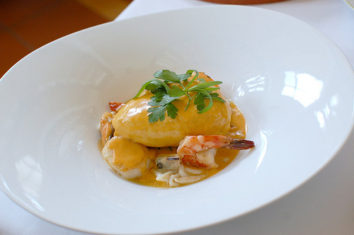

# Nantua sauce

*An excellent sauce for scallops, langoustine and any white fish with delicate, firm flesh.*

**Servings:** 8

## Ingredients
- 80 grams butter
- 60 grams shallots (very finely sliced)
- 60 grams button mushrooms (very finely sliced)
- 16 crayfish or langoustine heads (roughly chopped)
- 2 tablespoons cognac
- 150 ml dry white wine
- 300 ml Fish stock
- 1 Bouquet garni
- 2 sprigs tarragon
- 80 grams tomatoes (very ripe, peeled and de-seeded)
- 1 pinch cayenne pepper
- 300 ml double cream
- 1 pinch tarragon (very finely chopped to serve)
- salt and pepper

## Method
1. Melt 40 gram butter in a shallow saucepan over a low heat. Add the sliced shallots and mushrooms and sweat for 1 minute.
1. Add the crayfish or langoustine heads to the pan, increase the heat and fry briskly for 2-3 minutes, stirring continuously with a spatula.
1. Pour in the cognac and ignite with a match. Once the flames have died down, add the white wine and reduce by half, then pour in the fish stock. 
1. Bring to the boil, then lower the heat so that the sauce bubbles gently.
1. Add the bouquet garni, tomatoes, cayenne and a sprinkle of salt and cook for 30 minutes.
1. Stir in the cream and the let sauce bubble for another 10 minutes. 
1. Discard the bouquet garni. 
1. Transfer the contents of the pan to a blender and purée for 2 minutes.
1. Strain the sauce through a fine-meshed conical sieve into a clean saucepan, rubbing it through with the back of a ladle. 
1. Bring the sauce back to the boil and season with salt and pepper to taste.
1. Off the heat, whisk in the remaining butter, a little at a time, until the sauce is smooth and glossy.
1. It is now ready to serve. A little finely chopped tarragon added at the last moment with enhance the flavour.