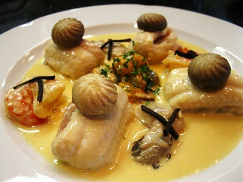

# Normandy sauce

*The classic sauce for sole à la Normande, this goes well with most white fish. The addition of mussel cooking juices makes it extra special.*

**Servings:** 6

## Ingredients
- 60 grams butter
- 30 grams plain flour
- 100 grams button mushrooms (thinly sliced)
- 1 sprig thyme
- 500 ml Fish stock
- 50 ml  mussel juice (optional)
- 200 ml  double cream
- 3 egg yolks
- juice of 1/2 a lemon
- salt and pepper

## Method
1. Melt 30 grams of butter in a heavy-bases saucepan, then take off the heat and stir in the flour. 
1. Return to a medium-low heat and cook for 2 - 3 minutes, stirring constantly, to make a white roux.
1. Meanwhile, melt the remaining 30 grams of butter in another saucepan over a low heat. 
1. Add the mushrooms and thyme and sweat them for 2 minutes, then stir in the hot roux.
1. Gradually pour in the fish stock and mussel juice, if using, mixing with a small whisk.
1. Bring to the boil, still whisking, and let the sauce bubble gently for 20 minutes, stirring it with the whisk every 5 minutes.
1. Meanwhile, mix the cream with the egg yolks. Stir the mixture into the sauce with the lemon juice and let it continue to bubble gently for another 10 minutes.
1. Season to taste with salt and white pepper. Pass the sauce through a fine-meshed conical sieve and serve immediately.