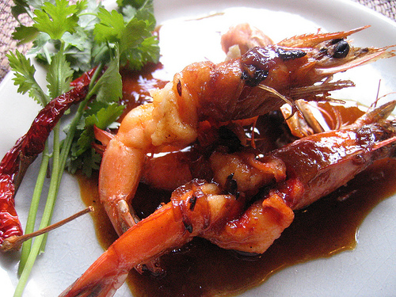

# Tamarind sauce

*Tamarind sauce is superb with steamed firm-fleshed fish, such as halibut or monkfish or shellfish like prawn.*

**Servings:** 4

## Ingredients
- 2 tablespoons groundnut oil
- 4 spring onions (3 cm julienne)
- 3 cloves garlic
- 2 tablespoons ginger (grated)
- 2 tablespoons light soy sauce
- 1 tablespoon palm sugar
- 2 tablespoons taramind paste
- 1 tablespoon fish sauce
- 10 black peppercorns (crushed)

## Method
1. Heat the groundnut oil in a frying pan, add the spring onions and sauté over a medium heat until softened.
1. Add the garlic and ginger, reduce the heat to low and cook for 2 minutes.
1. Add the remaining ingredients to the pan and simmer gently, stirring occasionally, for a further 2 minutes.
1. Transfer the sauce to a bowl and cover with cling film, piercing it in a few places. 
1. Leave to stand for about 20 minutes before serving.