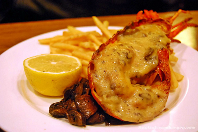

# Thermidor sauce

*This famous companion to lobster thermidor works with most crustaceans. It tastes wonderful mixed with crab meat and served au gratin.*

**Servings:** 6

## Ingredients
- 40 grams shallots (very finely chopped)
- 200 ml Fish stock
- 200 ml dry white wine
- 300 ml Béchamel Sauce
- 100 ml double cream
- 1 teaspoon Dijon mustard
- 1 teaspoon English mustard powder
- 50 grams butter (well chilled and diced)
- 1 pinch cayenne pepper
- 1 tablespoon tarragon (finely chopped) 
- salt

## Method
1. Combine the shallot, fish stock and white wine in a saucepan and let bubble until the liquid has reduced by two-thirds. 
1. Add the béchamel and cook the sauce over a low heat for 20 minutes, stirring every 5 minutes.
1. Pour in the cream, let bubble for 5 minutes, then add both mustards and cook for another 2 minutes.
1. Turn off the heat and whisk the butter into the sauce, a piece at a time. Season with salt and a good pinch of cayenne to taste. 
1. Finally add the tarragon, if using, and serve immediately.

**Note**:  If you wish, add a teaspoonful of Cognac to the sauce at the end of cooking.