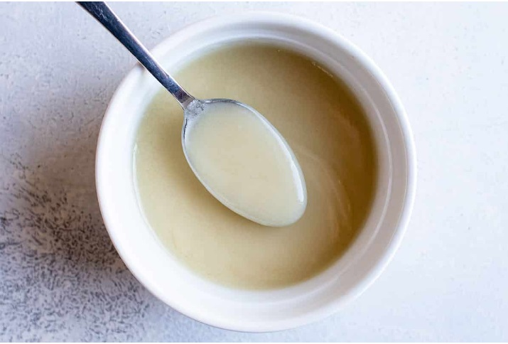

# Velouté sauce

## Ingredients
- 30g butter
- 30g plain flour (sifted)
- 1 litre cold stock (fish, chicken, or vegetable)
- salt and freshly ground black pepper

## Method
### For the roux
1. Melt the butter is a heavy-based saucepan.
1. Remove the pan from the heat and and the flour, stirring with a whisk.
1. Return the pan to a medium heat and cook for about 3 minutes, stirring constantly.

## For the sauce
1. Pour the cold stock on to the roux, stirring constantly.
1. Cook the suace over a low heat for about 30 minutes, occasionally stirring with a whisk.
1. Season with salt and pepper.
