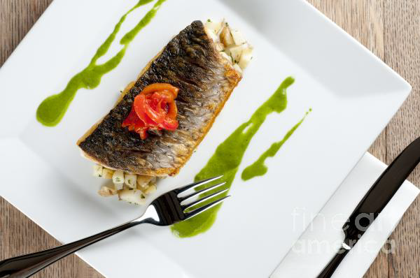

# Watercress sauce

*A fresh-tasting sauce to serve with grilled scallops, lightly poached oysters or pan-fried fillets of sea bass or bream. It is extremely light, almost like a bouillon.*

**Servings:** 8

## Ingredients
- 400 grams watercress
- 100 grams butter
- 500 ml Vegetable stock
- 15 grams soft green peppercorns
- salt and pepper

## Method
1. Cut off and discard the thicker watercress stalks, retaining only the most slender stems. 
1. Melt 30 grams of the butter in a saucepan.
1. Add the watercress and sweat over a low heat for 3 minutes, stirring continuously with a spatula.
1. Add the vegetable stock and green peppercorns, increase the heat to medium and cook for 10 minutes.
1. Turn off the heat and leave the sauce to infuse for 10 minutes, then purée using a blender for 2 minutes.
1. Pass the sauce through a fine-meshed conical sieve into a clean saucepan, rubbing it through with the back of a ladle.
1. Reheat until gently bubbling, then take the pan off the heat and whisk in the remaining butter, a knob at a time. 
1. Season with salt and pepper to taste. Serve hot.