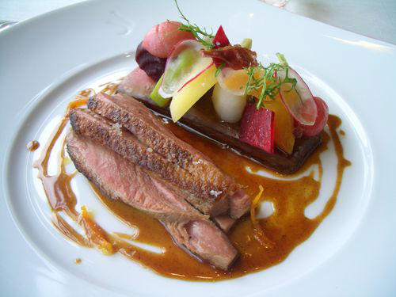

# Bigarade sauce

*This is the classic sauce for duck à l'Orange.*

**Serves:** 6

## Ingredients
- 1 lemon
- 3 oranges
- 45 grams caster sugar
- 3 tablespoons red wine vinegar
- 300 grams duck wings
- 2 tablespoons olive oil
- 700 ml Veal stock
- salt and pepper

## Method
1. Finely pare the zest from the lemon and two of the oranges and reserve. 
1. Squeeze the juice from all of the citrus fruit and set aside.
1. Put the sugar and wine vinegar into a deep frying pan and dissolve over a very low heat. 
1. Continue to cook until you have a deep golden caramel.
1. Meanwhile, heat the oil in another pan, and very quickly brown the duck wings, turning to colour all over.
1. As soon as the vinegar syrup has formed a caramel, pour in the veal stock and citrus juices, then add the duck wings.
1. Bring to the boil, lower the heat and cook gently for 45 minutes, skimming the surface if necessary. 
1. The sauce should be thick enough to lightly coat the back of a spoon. If it is not, cook for a little longer.
1. In the meantime, cut the citrus zests into a fine julienne. 
1. Add to a pan of boiling water and blanch for 1 minute. Drain thoroughly.
1. Pass the sauce through a fine-meshed conical sieve into a clean pan and season with salt and pepper to taste, then add the citrus zests. 
1. The sauce is now ready to serve.
1. If you are not using the sauce immediately, keep it warm in a bain-marie but only add the zests when you are ready to serve.