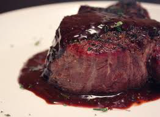

# Bordelaise sauce

*This wonderful sauce looks as good as it tastes. It is delicious with any cut of beef, especially entrecôte, rib and sirloin. Remember to soak the beef marrow in advance.*

**Serves:** 4

## Ingredients
- 40 grams shallots (finely chopped)
- 8 white peppercorns (crushed)
- 200 ml red wine (preferably claret)
- 300 ml Veal stock
- 1 Bouquet garni
- 200 grams beef marrow (soaked in ice water for 4 hours)
- 30 grams butter (chilled and diced)
- salt and pepper

## Method
1. Put the shallots, crushed peppercorns and red wine in a saucepan and set over a high heat.
1. Let bubble until the wine has reduced by one-third.
1. Add the veal stock and bouquet garni and bubble gently for about 20 minutes, or until the sauce has reduced and thickened enough to lightly coat the back of a spoon. 
1. Pass it through a conical sieve into a clean saucepan.
1. Drain the beef marrow and cut it into small pieces. 
1. Place in a small saucepan, cover with a little cold water and salt lightly. 
1. Bring to the boil over a medium heat. Immediately turn off the heat, leave the marrow for 30 seconds, then drain it carefully.
1. Season the sauce with salt and pepper to taste. 
1. Whisk in the butter, a piece at a time, then add the well-drained beef marrow. 
1. Taste and adjust the seasoning. 
1. Serve immediately.