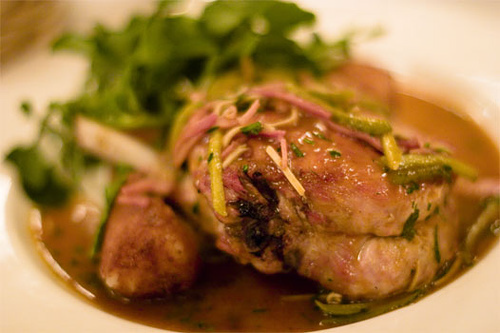

# Charcutière sauce

*This homely piquant sauce is delicious with pork chops.*

**Serves:** 4

## Ingredients
- 30 grams butter
- 60 grams onions (finely chopped)
- 100 ml dry white wine
- 300 ml Veal stock
- 1 tablespoon strong Dijon mustard
- 40 grams beurre manié (see notes)
- 30 grams cornichons (cut into long thin strips
- salt and pepper

## Method
1. Melt the butter in a small saucepan, add the onions and sweat gently without colouring for 1 minute. 
1. Pour in the white wine and let bubble over a medium heat to reduce by half.
1. Add the veal stock and bubble the sauce gently until it is thick enough to lightly coat the back of a spoon. 
1. Whisk in the mustard and the beurre manié, a little at a time, and cook for another 2 minutes. 
1. Season with salt and pepper to taste.
1. Pass the sauce through a fine-meshed conical sieve into a small pan containing the cornichons. 
1. Serve it immediately, or keep warm for a few minutes in a bain-marie set over a low heat.

**Note**: A beurre manié is a mixture of equal parts soft butter and flour, mixed together with a fork, which can be used to thicken an overly liquid or thin sauce very swiftly at the end of cooking. It should be incorporated into the sauce a small piece at a time.
