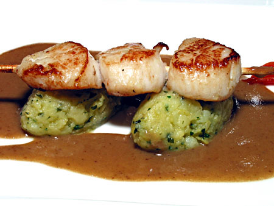

# Chasseur sauce

*This light mushroom and white wine sauce is quick to make, and goes well with poultry and veal.*

**Serves:** 8

## Ingredients
- 50 grams butter (at room temperature)
- 50 grams butter (chilled and diced)
- 200 grams button mushrooms (wiped and finely sliced)
- 40 grams shallots (finely chopped)
- 400 ml dry white wine
- 400 ml Veal stock
- 1 tablespoon flat leaf parsley (snipped)
- 1 teaspoon tarragon (snipped)
- salt and pepper

## Method
1. Melt the non-chilled butter in a shallow pan, add the mushrooms and cook over a medium heat for 1 minute. 
1. Add the shallot and cook for another minute, taking care not to let it colour.
1. Tip the mushroom and shallot mixture into a fine-meshed conical sieve to drain off the cooking butter, then return to the shallow pan. 
1. Add the white wine and let bubble over a medium heat until reduced by a half.
1. Pour in the veal stock and cook gently for 10-15 minutes until the sauce has reduced and thickened enough to lightly coat the back of a spoon.
1. Take the pan off the heat and whisk in the remaining butter, a piece at a time, along with the snipped herbs. 
1. Season to taste with salt and pepper. 
1. The sauce is now ready to serve.