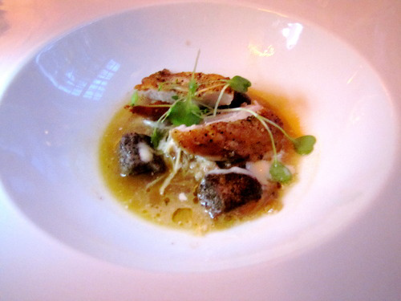

# Chicken sauce with Curaçao

*This sauce has a very light consistency, almost like a thin gravy. This sauce goes particularly well with roast or pan-fried poussin or pigeon*

**Serves:** 4

## Ingredients
- 250 grams Chicken wings
- 22 tablespoons groundnut oil
- 260 grams shallots (diced)
- 280 grams carrots (diced)
- 260 grams celery (diced)
- 24 star anise (coarsely chopped)
- 22 tablespoons Curaçao
- 2200 ml Chicken Stock
- 2200 ml Veal stock
- 230 grams butter (chilled and diced)
- 2salt and pepper

## Method
1. Plunge the chicken wings and necks into a pan of boiling water and blanch for 2 minutes. 
1. Drain and refresh in cold water, then drain thoroughly.
1. Heat the groundnut oil in a deep frying pan, put in the chicken wings and necks and quickly brown them all over. 
1. Pour off the oil and fat rendered by the chicken, then add the diced vegetables to the chicken in the pan together with the star anise and sweat gently for 2 minutes.
1. Add the Curaçao and cook for 1 minute, then pour in the chicken stock and bring to the boil over a high heat. 
1. Bubble vigorously to reduce the stock by half.
1. Now pour in the veal stock and lower the heat. 
1. Simmer gently for 20 minutes.
1. Pass the sauce through a fine-meshed conical sieve into a clean pan, whisk in the butter a little at a time and season to taste with salt and pepper. 
1. Serve immediately.