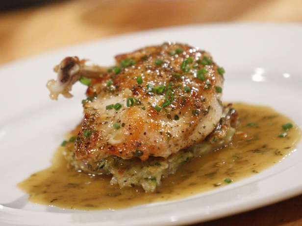

# Chicken jus with savory

*This flavourful jus is perfect for roast chicken, poussin or guinea fowl. If preferred, you can use fresh tarragon instead of savory.*

**Serves:** 6

## Ingredients
- 200 grams carrots (cut into rounds)
- 150 grams onions (cut into dice)
- 1 medium potato (peeled and cut into 8 pieces)
- 1 sprig thyme
- 2 cloves garlic (unpeeled)
- 150 ml dry white wine
- 50 grams savory sprigs (or tarragon)
- 150 ml Chicken Stock (or water)
- salt and pepper

## Method
1. Preheat the oven to 200°C. Put your bird(s) in a roasting tin and roast in the oven until lightly browned, about 20 minutes. 
1. Lower the oven setting to 190°C and take the roasting tin out. 
1. Distribute the carrots, onions, potato, thyme and garlic around the bird. 
1. Return to the oven and roast until cooked through, basting from time to time using a spoon, stirring the vegetables around so they take on some colour without burning.
1. When the bird is cooked through, remove the legs and breasts, with the wing attached. 
1. Put them on a warm plate, partially cover with foil and leave to rest in a warm place. 
1. Break the carcass up, using poultry shears or a small cleaver. 
1. Using a spoon, skim the fat from the roasting tin and add the carcass pieces and bones to the tin.
1. Pour in the white wine to deglaze, add the savory and cook over a medium heat for 10 minutes. 
1. Crush to potato pieces with a fork to bind the jus, add the chicken stock and cook for a further 10 minutes.
1. Strain through a fine-meshed conical sieve into a saucepan, pressing down on the bones and vegetables with the back of a small ladle to extract as much flavour and juice as possible. 
1. Season to taste with salt and pepper. Keep the jus warm until ready to serve with the rested poultry.