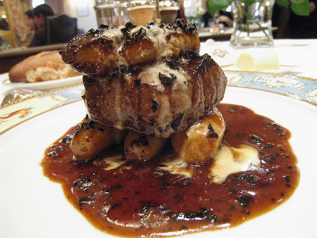

# Périgueux sauce

*This sauce is excellent served with little hot pies or pâté en croûte, with beef tournedos or pan-fried saddle of lamb, and of course on pasta.*

**Serves:** 6

## Ingredients
- 400 ml Veal stock
- 50 ml truffle juice
- 20 grams truffles (finely chopped or sliced)
- 40 grams butter (chilled and diced)
- salt and pepper

## Method
1. Bring the veal stock to the boil in a small saucepan and let bubble over a medium heat to reduce until it is thick enough to lightly coat the back of a spoon.
1. Add the truffle juice and cook for another 5 minutes. 
1. Add the chopped truffles and let the sauce bubble briefly.
1. Take the pan off the heat and add the butter, a piece at a time, swirling and rotating the pan to incorporate it. 
1. Season the sauce with salt and pepper to taste and serve immediately.