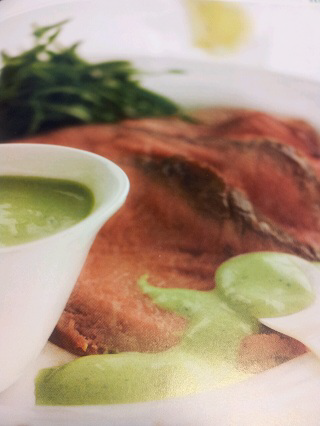

# Rocket sauce with horseradish

*This fresh tasting, healthy sauce goes beautifully with cold meat, or with cold poached salmon or smoked trout.*

**Servings:** 8

## Ingredients
- 60 grams rocket leaves (stalks removed)
- 1 tablespoon Dijon mustard
- 3 teaspoons fresh horseradish (finely grated)
- 2 tablespoons extra virgin olive oil
- 2 tablespoons milk
- 1 lemon juice
- 1 clove garlic (finely chopped)
- 150 grams Greek yoghurt
- salt and pepper

## Method
1. Put all the ingredients, except the yoghurt and seasoning into a blender and process for 2-3 minutes until smooth.
1. Transfer to a large bowl and whisk in the yoghurt until combined. 
1. Season the sauce with salt and pepper to taste.
1. Cover with cling film and refrigerate until ready to sue. 
1. This sauce keeps well for 2-3 days in the fridge, needing only a quick whisk before serving.