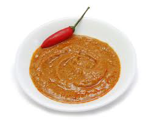

# Satay sauce

*This goes very well with barbequed or grilled brochettes of pork, lamb or chicken.*

**Servings:** 8

## Ingredients
- 8 tablespoons crunchy peanut butter
- 1 clove garlic
- 1 tablespoon palm sugar
- 2 tablespoons dark soy sauce
- 1 tablespoon lemon juice
- 2 tablespoons tamarind liquid
- a generous pinch of chilli powder
- a little coconut milk to bind the sauce

## Method
1. Put the peanut butter into a saucepan with 100 ml of water and heat gently, stirring with a wooden spoon. 
1. As soon as it starts to boil, remove from the heat and add the remaining ingredients. 
1. Stir until thoroughly mixed, then set aside until ready to use.
1. This sauce is best served hot or warm.
