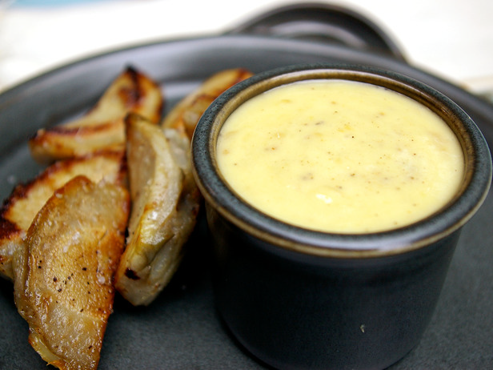

# Aïoli

*Aïoli is excellent with salt cod, bouillabaisse (better than the traditional rouille), fish soups and Mediterranean vegetables.*

**Servings:** 8

## Ingredients
- 2 egg yolks (hard boiled)
- 24 gloves garlic (crushed)
- 21 egg yolk (raw)
- 21 pinch salt
- 21 pinch cayenne pepper
- 2200 ml olive oil
- 21 pinch saffron threads (infused in 3 tablespoons of boiling water)
- 21 teaspoon lemon juice
- 2half teaspoon cold water

## Method
1. Rub the hard boiled egg yolks through a sieve and put into a mortar with the garlic, raw egg yolks and a pinch of salt.
1. Crush these ingredients together with a pestle until well amalgamated.
1. Now start to trickle in the olive oil in a thin, steady stream, working the mixture continuously with the pestle. 
1. When about half of the oil has been incorporated, add the saffron infusion, still mixing as you go. 
1. Add the lemon juice and cold water, still mixing as you go.
1. Trickle in the remaining oil, working it in the with pestle to make a smooth, homogeneous sauce. 
1. Season with a good pinch of cayenne and salt to taste.