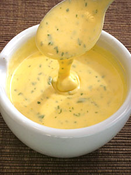

# Béarnaise sauce

*This sauce is equally good with grilled steak and beef fondue.*

**Servings:** 6

## Ingredients
- 2 tablespoons white wine vinegar
- 3 tablespoons tarragon (snipped)
- 30 grams shallots (finely chopped)
- 10 peppercorns (crushed)
- 4 egg yolks
- 250 grams Clarified butter (cooled to tepid)
- salt and pepper
- 2 tablespoons parsley
- juice of half a lemon

## Method
1. Combine the wine vinegar, 2 tablespoons of the tarragon, the shallots and peppercorns in a small, heavy-based saucepan and reduce by half over a low heat.
1. Seat aside to cool. When the vinegar reduction is cold, add the egg yolks and 3 tablespoons of cold water. 
1. Set the pan over a low heat, and whisk continuously, making sure that the whisk remains in contact with the bottom of the pan. 
1. As you whisk, gently increase the heat; the sauce should emulsify slowly and gradually, becoming smooth after 8-10 minutes. 
1. Do not let the sauce go above 65° C. Turn off the heat and whisk the clarified butter into the sauce, a little at a time. 
1. Season with salt and pepper to taste and pass through a fine meshed conical sieve into a clean pan. 
1. Stir in the rest of the tarragon, parsley and lemon juice. Check the seasoning, and serve.