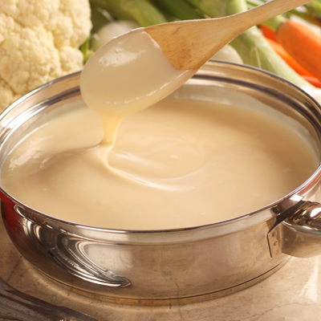

# Béchamel sauce

*This sauce features in a variety of dishes, such as lasagne and croque monsieur. Béchamel goes well with vegetables, white meats and ham, and forms the basis of many other sauces.*

**Servings:** 4

## Ingredients
- 30 grams butter
- 30 grams plain flour
- 500 ml milk
- 1 pinch salt and pepper
- ½ teaspoon nutmeg (grated)

## Method
1. Melt the butter in a small, heavy based saucepan over a low heat, and then add the flour. 
1. Stir with a whisk, and cook gently for 2-3 minutes to make a white roux.
1. Pour the cold milk on to the roux, whisking as you do so, and bring to the boil over a medium heat, whisking continuously.
1. When the sauce comes to the boil, lower the heat and simmer gently for about 10 minutes, stirring frequently. 
1. Season to taste with freshly ground salt and pepper. 
1. Add the nutmeg if you wish, and pass through a fine-meshed conical sieve.