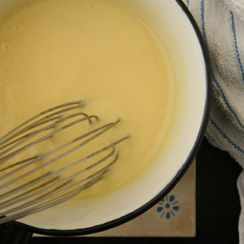

# Beurre blanc with cream

*Simple and delicate, this sauce is delicious with most poached fish.*

**Servings:** 6

## Ingredients
- 75 ml dry white wine
- 75 ml white wine vinegar
- 60 grams shallots (finely chopped)
- 50 ml double cream
- 200 grams butter (chilled and diced)
- salt and pepper

## Method
1. Combine the white wine, wine vinegar and shallots in a small, heavy-based saucepan and reduce the liquid over a low heat by two-thirds. 
1. Add the cream and reduce again by one-third.
1. Over a low heat, whisk in the butter, a little at a time, or beat in using a wooden spoon. 
1. It is vital to keep the sauce barely simmering at 90°C as you incorporate the butter, making sure it does not boil. 
1. Season to taste with salt and pepper and serve immediately.