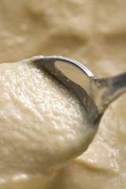

# Bread sauce

*The perfect traditional sauce to accompany a roast dinner.*

**Servings:** 4

## Ingredients
- 20 grams butter
- 60 grams onion (chopped)
- 400 ml milk
- 1 onion (peeled)
- 2 cloves
- 80 grams white bread (crusts removed and cut into cubes)
- 50 ml double cream
- 1 pinch salt and pepper

## Method
1. Insert the cloves in to the onion. Melt the butter in a small saucepan, and add the chopped onions and sweat gently for 1 minute. 
1. Pour in the milk and add the clove-studded onion and bring to a bare simmer. 
1. Cook gently, stirring occasionally, for 20 minutes.
1. Stir in the bread cubes and bring to the boil. 
1. Lower the heat and cook the sauce gently for 30 minutes, stirring occasionally with a wooden spoon.
1. Remove the studded onion, add the cream and let the sauce bubble gently for 5 minutes, whisking delicately. 
1. Season with salt and pepper to taste and serve.