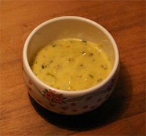

# Gribiche Sauce

*This piquant sauce is especially good served with cold fish, crustaceans, smoked trout and hard boiled eggs.*

**Servings:** 6

## Ingredients
- 4 hard boiled eggs
- 1 teaspoon Dijon mustard
- 250 ml groundnut oil
- 1 tablespoon white wine vinegar
- 30 grams capers (drained)
- 30 grams cornichons (finely diced)
- 2 tablespoons Fines Herbes (finely snipped)
- salt and pepper

## Method
1. Separate the hard-boiled egg whites and yolks. 
1. Put the yolks, mustard and a little salt and pepper into a mortar and crush with he pestle to make a smooth paste.
1. Gradually trickle in half of the groundnut oil, mixing with the pestle as you go to amalgamate it thoroughly. 
1. Still mixing, add the wine vinegar, then continue to trickle in the remaining oil as before.
1. Coarsely chop the hard boiled-egg whites. 
1. Add to the sauce with the capers, cornichons and herbs and mix them in with a spoon. 
1. Season the sauce with salt and pepper to taste.