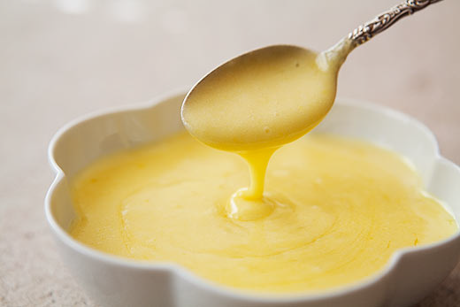

# Hollandaise sauce

*This light, creamy classic has inspired a host of other sauces.*

**Servings:** 

## Ingredients
- 1 tablespoon white wine vinegar
- 1 teaspoon white peppercorns (crushed)
- 4 egg yolks
- 250 grams Clarified butter (cooled to tepid)
- salt
- juice of half a lemon (optional)

## Method
1. In a thick-bottomed stainless steel or copper saucepan, mix the wine vinegar with 4 tablespoons of cold water and the crushed peppercorns. 
1. Heat and allow to bubble so it reduces by one third, then leave to cool completely.
1. Add the egg yolks to the cold reduction and mix with a whisk.
1. Put the saucepan on a heat diffuser over a very low heat and continue whisking, making sure that the whisk remains in contact with the bottom of the pan.
1. Gradually increase the heat so that the sauce emulsifies progressively, becoming very smooth and creamy after 8-10 minutes. 
1. Do not allow the temperature of the sauce to rise above 65°C.
1. Off the heat and still whisking, pour in the tepid clarified butter in a steady stream. 
1. Season with salt to taste. 
1. At the very last moment, stir in the lemon juice. 
1. Pass the sauce through a muslin-lined conical strainer to eliminate the crushed pepper if required, then serve immediately.