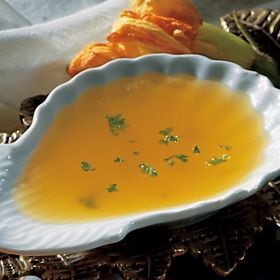

# Lemon butter sauce

*This simple sauce compliments cod and salmon dishes perfectly.
*

**Servings:** 4 - 6

## Ingredients
- 225 grams unsalted butter
- juice of 1 lemon
- 50 ml stock (Chicken or vegetable)
- salt and freshly ground white pepper

## Method
1. Chop the butter into 1 cm pieces and put into a pan with the lemon juice and stock.
1. Bring to a simmer, whisking all the time.
1. Do not allow the sauce to boil or the butter will separate.
1. If it is too thick, add more stock.
1. If you prefer a sharper taste, add more lemon juice.
1. Season with salt and serve immediately.
1. To give a creamier texture, purée in a blender.