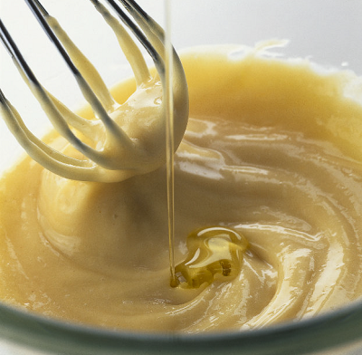

# Mayonnaise

*If your mayonnaise separates instead of remaining suspended in an emulsion then leave the mayonnaise out at room temperature for 30 minutes. Using a high speed mixer, beat in half a teaspoon of mustard. Put a spoon full of warm water in a bowl, and beat in a spoonful of the broken mayonnaise, adding it bit by bit and beating at high speed.  The mixture should foam. Add a second spoon of the broken mayonnaise, then a third. You should see the sauce thickening, and taking. Now using a small ladle, very gradually incorporate the rest of the broken mayonnaise into the new mixture.*

**Yield:** 300ml

## Ingredients
- 2 egg yolks (at room temperature)
- 1 tablespoon Dijon mustard (strong)
- 250 ml groundnut oil
- 2 tablespoons white wine vinegar (or lemon juice)
- salt and pepper

## Method
1. Stand a mixing bowl on a tea-towel on the work surface. 
Put the egg yolks, mustard, a little salt and pepper into the bowl and mix with a balloon whisk.
1. Slowly add the oil in a thin trickle to begin with, whisking continuously. 
1. As the mayonnaise begins to thicken, add the oil in a steady stream, still whisking all the time.
1. When the oil is completely incorporated, whisk more rapidly for 30 seconds until the mayonnaise is thick and glossy. 
1. Add the vinegar or lemon juice, taste and adjust the seasoning as necessary.